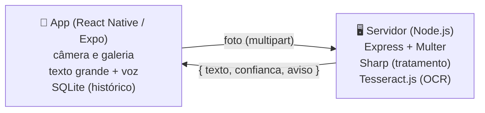

# Leitor Fácil

App de celular que transforma papel impresso em **letra grande e voz**, para idosos e pessoas com baixa visão. A pessoa fotografa uma bula, receita, conta de luz ou carta, e o app mostra o texto em fonte gigante, com alto contraste, e lê em voz alta.

MVP desenvolvido para a disciplina de Acessibilidade (**Proposta 1: Desenvolvimento de MVP Assistivo de Baixo Custo**), Engenharia de Software, UEPG.


<sub>Prévia das telas (renderizada no navegador; no celular a fonte é a do sistema).</sub>

## O problema

Muitos documentos importantes do dia a dia vêm impressos em letra pequena. Pessoas com baixa visão (catarata, glaucoma, degeneração macular, retinopatia diabética) e muitos idosos dependem de outra pessoa para lê-los, o que reduz a autonomia e pode levar a erros, como tomar um remédio na dose errada.

## Funcionalidades

- Fotografar o papel com a câmera ou escolher uma foto da galeria
- Reconhecimento de texto (OCR) em português
- Texto em letra grande, com botões para aumentar e diminuir
- Leitura em voz alta automática, com botões para parar e mudar a velocidade
- Dois temas de alto contraste: amarelo no preto e preto no branco (ambos acima do nível AAA da WCAG)
- Aviso quando a foto sai ruim (pouco nítida ou sem texto), falado e escrito
- Histórico das últimas 30 leituras, salvo apenas no celular, com opção de apagar
- Preferências lembradas (tamanho da letra, velocidade da voz, cores)
- Textos longos (bulas inteiras) lidos em partes, sem cortar no meio
- Aviso na tela inicial quando o serviço de leitura não responde, com botão "Tentar de novo"

## Decisões de acessibilidade

| Decisão | Motivo |
|---|---|
| Botões com no mínimo 88 dp de altura | Público com baixa visão e, às vezes, tremor nas mãos (a recomendação geral é 48 dp) |
| Poucos botões por tela, sempre com texto | Ícones sozinhos são difíceis de enxergar e de entender |
| `accessibilityLabel`, `accessibilityRole` e `accessibilityHint` em todos os botões | Compatível com leitores de tela (TalkBack e VoiceOver) |
| Respeita o tamanho de fonte do sistema | Quem já aumentou a fonte do celular não precisa ajustar de novo |
| Leitura automática ao abrir o resultado | A pessoa não precisa procurar o botão "ouvir" |
| Avisos falados, não só escritos | Quem não enxerga bem também fica sabendo quando algo deu errado |
| "Lendo o papel. Aguarde." falado durante o OCR | A pessoa sabe que o app está trabalhando e não toca de novo |
| Um só botão "Ouvir" / "Parar voz" | Menos botões na tela; o rótulo mostra o que vai acontecer |
| Botão "voltar" do Android volta ao início | Evita fechar o app sem querer |
| Confirmação antes de apagar uma leitura | Evita perder uma leitura por um toque acidental (tremor) |

## Arquitetura



- **`mobile/`**: app React Native com Expo. Usa `expo-image-picker` (câmera), `expo-speech` (voz) e `expo-sqlite` (banco local).
- **`server/`**: API Node que recebe a foto, melhora a imagem (corrige rotação, tira a cor, aumenta o contraste) e faz o OCR.

**Privacidade:** a foto é processada só na memória do servidor e descartada em seguida; nada é gravado em disco. O histórico fica apenas no SQLite do celular. Isso reduz a exposição de dados pessoais (receitas, contas), em linha com a LGPD.

**Baixo custo:** todas as bibliotecas são gratuitas e de código aberto, o OCR roda no próprio servidor (sem pagar API) e o app funciona em qualquer celular Android ou iPhone, sem hardware extra.

## Como rodar

### Pré-requisitos

- Node.js 18 ou mais recente
- Celular com o app **Expo Go** (Play Store / App Store)
- Computador e celular na mesma rede Wi-Fi

### 1. Servidor

```bash
cd server
npm install
npm start
```

O modelo de português do OCR vem junto no `npm install` (pacote `@tesseract.js-data/por`), então o servidor não baixa nada ao iniciar. Quando aparecer `Servidor no ar na porta 3000.`, está pronto. Cada leitura aparece no terminal com o tamanho do texto, a confiança e o tempo.

Para testar sem o app:

```bash
curl http://localhost:3000/saude
curl -F "foto=@caminho/da/foto.jpg" http://localhost:3000/ler
```

Testes automáticos (11 testes, com o OCR de verdade: bula, acentos, foto deitada, foto escura, foto sem texto e erros):

```bash
npm test
```

Para usar outra porta: `PORT=4000 npm start` (no Windows PowerShell: `$env:PORT=4000; npm start`).

### 2. App

1. Descubra o IP do computador na rede (Windows: `ipconfig` → "Endereço IPv4"; Linux/Mac: `ip addr`).
2. Dentro de `mobile/`, copie `.env.example` para `.env` e coloque esse IP:
   ```
   EXPO_PUBLIC_API_URL=http://192.168.0.15:3000
   ```
   O `.env` não vai para o GitHub, então cada pessoa do grupo usa o IP da própria máquina sem conflito. (Sem `.env`, vale o endereço em `mobile/src/config.js`.)
3. Instale e rode:

   ```bash
   cd mobile
   npm install
   npx expo install --fix
   npx expo start
   ```

4. Escaneie o QR code com o Expo Go (Android) ou com a câmera (iPhone).

> **"Project is incompatible with this version of Expo Go"?** O Expo Go da loja só roda a versão mais recente do SDK (o projeto começou no SDK 57). Atualize com `npm install expo@latest` e depois `npx expo install --fix`.

> **"O serviço de leitura não está respondendo"?** Confira o IP no `.env`, se o servidor está rodando e se o firewall do Windows está liberando a porta 3000 para redes privadas. Um teste rápido é abrir `http://SEU_IP:3000/saude` no navegador do celular. Depois de mudar o `.env`, reinicie o `npx expo start`.

> **Vai gerar um APK?** No Expo Go tudo funciona. Num APK próprio, o Android bloqueia `http://` por padrão; nesse caso publiquem o servidor com `https://` ou liberem o tráfego com o plugin `expo-build-properties` (`android.usesCleartextTraffic: true`).

## Estrutura do repositório

```
leitor-facil/
├── server/
│   ├── src/
│   │   ├── index.js          # sobe o servidor
│   │   ├── app.js            # rotas da API (/ler e /saude) e tratamento de erros
│   │   └── ocr.js            # tratamento da imagem + Tesseract
│   └── test/
│       └── api.test.js       # testes automáticos (npm test)
├── mobile/
│   ├── App.js                # controle das telas e do fluxo foto → leitura
│   ├── .env.example          # modelo para o endereço do servidor
│   └── src/
│       ├── config.js         # endereço do servidor
│       ├── api.js            # envio da foto e checagem do servidor
│       ├── db.js             # SQLite: histórico e preferências
│       ├── fala.js           # leitura em voz alta (expo-speech)
│       ├── texto.js          # divide textos longos para a voz
│       ├── theme.js          # cores de alto contraste e tamanhos
│       ├── components/
│       │   └── BotaoGrande.js
│       └── screens/
│           ├── InicioScreen.js
│           ├── ResultadoScreen.js
│           └── HistoricoScreen.js
└── docs/
    ├── co-design.md          # registro das sessões com os usuários
    ├── roteiro-video.md      # roteiro do vídeo de 5 minutos
    └── img/                  # imagens do README
```

## API

### `POST /ler`

Corpo `multipart/form-data` com o campo `foto` (imagem de até 10 MB).

Resposta:

```json
{
  "texto": "PARACETAMOL 750 mg\nTomar 1 comprimido a cada 8 horas",
  "confianca": 82,
  "aviso": null
}
```

`aviso` vem preenchido quando a confiança do OCR fica abaixo de 45% ou nenhum texto é encontrado.

Erros vêm como `{ "erro": "mensagem" }`: `400` (sem foto, arquivo que não é imagem ou imagem corrompida), `413` (maior que 10 MB) e `500` (falha no OCR).

### `GET /saude`

Retorna `{ "status": "ok" }`. Útil para saber se o servidor está no ar.

## Co-design

O processo com os participantes fica registrado em [`docs/co-design.md`](docs/co-design.md).

## Como testar a acessibilidade

Além dos testes com os participantes, antes de gravar o vídeo:

- [ ] **TalkBack** (Android: Configurações → Acessibilidade) ou **VoiceOver** (iPhone): todos os botões são anunciados com nome e dica? Dá para usar o app inteiro só deslizando e tocando duas vezes?
- [ ] **Fonte do sistema no máximo**: o texto lido cresce junto? Algum botão ficou cortado?
- [ ] **Os dois temas** com o brilho da tela baixo e no sol.
- [ ] **Foto ruim** (tremida, escura, papel amassado): o aviso aparece e é falado?
- [ ] **Bula inteira**: a voz lê até o fim?
- [ ] **Servidor desligado**: a tela inicial avisa e o "Tentar de novo" funciona quando ele volta?
- [ ] **Botão voltar do Android** nas telas de resultado e histórico.

## Roteiro do vídeo

Sugestão de roteiro seguindo a estrutura da atividade (contexto → arquitetura → demonstração → próximos passos) em [`docs/roteiro-video.md`](docs/roteiro-video.md).

## Como trabalhar em grupo

1. Cada um cria uma branch a partir da `main` para o que vai fazer:
   `git checkout -b feature/nome-da-tarefa`
2. Faça commits pequenos e com mensagens claras.
3. Suba a branch (`git push -u origin feature/nome-da-tarefa`) e abra um **Pull Request** no GitHub.
4. Outra pessoa do grupo revisa antes de juntar na `main`.

### Checklist da entrega

- [ ] Sessão 1 de co-design (entrevistas) registrada
- [ ] Sessão 2 (protótipo) registrada
- [ ] App testado no celular com o checklist de "Como testar a acessibilidade"
- [ ] Sessão 3 (teste com o app) registrada, com a tabela "O que mudou"
- [ ] Mudanças pedidas pelos participantes implementadas
- [ ] Vídeo de até 5 min gravado (contexto → arquitetura → demonstração → próximos passos)
- [ ] Link do vídeo adicionado aqui no README

## Limitações conhecidas

- O OCR erra com fotos tremidas, escuras ou papel amassado. O app avisa quando a confiança é baixa, mas **o texto lido não substitui a orientação de um farmacêutico ou médico**.
- Precisa de conexão com o servidor: hoje, celular e computador na mesma rede Wi-Fi (ou o servidor publicado na internet).
- Textos manuscritos (letra de médico) geralmente não são reconhecidos.

## Autores

- Antônio Felipe Praiano
- João Victor Vardenski de Andrade
- Yuri Madureira Gouveia
