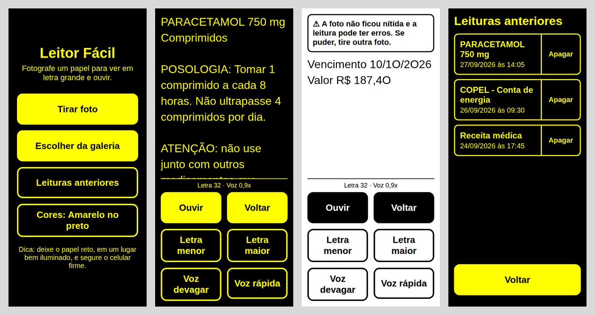
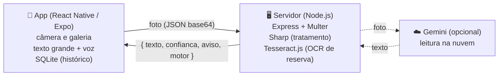

# Leitor Fácil

App de celular que transforma papel impresso em **letra grande e voz**, para idosos e pessoas com baixa visão. A pessoa fotografa uma bula, receita, conta de luz ou carta, e o app mostra o texto em fonte gigante, com alto contraste, e lê em voz alta.

MVP desenvolvido para a disciplina de Acessibilidade (**Proposta 1: Desenvolvimento de MVP Assistivo de Baixo Custo**), Engenharia de Software, UEPG.



<sub>Prévia das telas (renderizada no navegador; no celular a fonte é a do sistema).</sub>

## O problema

Muitos documentos importantes do dia a dia vêm impressos em letra pequena. Pessoas com baixa visão (catarata, glaucoma, degeneração macular, retinopatia diabética) e muitos idosos dependem de outra pessoa para lê-los, o que reduz a autonomia e pode levar a erros, como tomar um remédio na dose errada.

## Funcionalidades

- Fotografar o papel com a câmera do app, que tem uma **moldura** para enquadrar o texto (o que fica fora dela não é lido), ou escolher uma foto da galeria
- Reconhecimento de texto em português com o Gemini (nuvem), e o Tesseract (local) como reserva automática
- Texto em letra grande, com botões para aumentar e diminuir
- Leitura em voz alta automática, com botões para parar e mudar a velocidade
- Dois temas de alto contraste: amarelo no preto e preto no branco (ambos acima do nível AAA da WCAG)
- Aviso quando a foto sai ruim (pouco nítida ou sem texto), falado e escrito
- Histórico das últimas 30 leituras, salvo apenas no celular, com opção de apagar
- Preferências lembradas (tamanho da letra, velocidade da voz, cores)
- Textos longos (bulas inteiras) lidos em partes, sem cortar no meio
- Aviso na tela inicial quando o serviço de leitura não responde, com botão "Tentar de novo"

## Decisões de acessibilidade

| Decisão | Motivo |
|---|---|
| Botões com no mínimo 88 dp de altura | Público com baixa visão e, às vezes, tremor nas mãos (a recomendação geral é 48 dp) |
| Poucos botões por tela, sempre com texto | Ícones sozinhos são difíceis de enxergar e de entender |
| `accessibilityLabel`, `accessibilityRole` e `accessibilityHint` em todos os botões | Compatível com leitores de tela (TalkBack e VoiceOver) |
| Respeita o tamanho de fonte do sistema | Quem já aumentou a fonte do celular não precisa ajustar de novo |
| Leitura automática ao abrir o resultado | A pessoa não precisa procurar o botão "ouvir" |
| Avisos falados, não só escritos | Quem não enxerga bem também fica sabendo quando algo deu errado |
| "Lendo o papel. Aguarde." falado durante o OCR | A pessoa sabe que o app está trabalhando e não toca de novo |
| Um só botão "Ouvir" / "Parar voz" | Menos botões na tela; o rótulo mostra o que vai acontecer |
| Botão "voltar" do Android volta ao início | Evita fechar o app sem querer |
| Confirmação antes de apagar uma leitura | Evita perder uma leitura por um toque acidental (tremor) |

## Arquitetura



- **`mobile/`**: app React Native com Expo. Usa `expo-image-picker` (câmera), `expo-speech` (voz) e `expo-sqlite` (banco local).
- **`server/`**: API Node que recebe a foto e devolve o texto. Com a chave do Gemini configurada, ele lê a foto (mais preciso); sem a chave, ou se o Gemini falhar (sem internet, limite do plano grátis), o servidor usa o Tesseract, que roda no próprio computador. Para o Tesseract, a imagem é tratada antes (rotação, sem cor, mais contraste).

**Privacidade:** a foto é processada só na memória do servidor e descartada em seguida; nada é gravado em disco. O histórico fica apenas no SQLite do celular. Isso reduz a exposição de dados pessoais (receitas, contas), em linha com a LGPD.

Com o Gemini ligado, a foto sai do servidor e vai para o Google. No plano grátis, o Google informa que pode usar o conteúdo enviado para melhorar os produtos dele. Para uma versão real, com dados de pacientes, o certo seria o plano pago (que não usa os dados) ou só o Tesseract. Por isso o Tesseract continua no projeto e funciona sozinho.

**Baixo custo:** todas as bibliotecas são gratuitas e de código aberto, o Gemini é usado no plano grátis (sem cartão), o Tesseract roda no próprio servidor sem pagar nada e o app funciona em qualquer celular Android ou iPhone, sem hardware extra.

## Como rodar

### Pré-requisitos

- Node.js 18 ou mais recente
- Celular com o app **Expo Go** (Play Store / App Store)
- Computador e celular na mesma rede Wi-Fi

### 1. Servidor

```bash
cd server
npm install
npm start
```

O modelo de português do Tesseract vem junto no `npm install` (pacote `@tesseract.js-data/por`), então o servidor não baixa nada ao iniciar. Quando aparecer `Servidor no ar na porta 3000.`, está pronto. A linha seguinte diz qual motor está lendo as fotos, e cada leitura aparece no terminal com o motor, o tamanho do texto, a confiança e o tempo.

#### Leitura com o Gemini (opcional, recomendado)

1. Entre em [aistudio.google.com/apikey](https://aistudio.google.com/apikey) com uma conta Google e clique em **Create API key**. É grátis e não pede cartão.
2. Dentro de `server/`, copie `.env.example` para `.env` e cole a chave:
   ```
   GEMINI_API_KEY=sua-chave-aqui
   ```
3. Reinicie o servidor. Deve aparecer `Leitura: Gemini (gemini-3-flash-preview, ...), com Tesseract de reserva.`

No plano grátis, os modelos do Gemini às vezes ficam sobrecarregados (erro 503) ou lentos. Por isso o servidor tenta uma **lista de modelos** em ordem e, se nenhum responder em **25 segundos**, usa o Tesseract. Para ver como o Gemini está respondendo agora (chave, modelos disponíveis e tempo de leitura), rode `npm run testar-gemini` na pasta `server`.

O `.env` não vai para o GitHub: cada pessoa do grupo usa a própria chave. Nunca coloque a chave no app (`mobile/`), porque qualquer um conseguiria copiá-la. No mesmo `.env` dá para trocar o modelo (`GEMINI_MODELO`) ou usar o Google Cloud Vision (`GOOGLE_VISION_API_KEY`); veja os comentários do `.env.example`.

Para testar sem o app:

```bash
curl http://localhost:3000/saude
curl -F "foto=@caminho/da/foto.jpg" http://localhost:3000/ler
```

Testes automáticos (com o Tesseract de verdade: bula, foto em JSON, acentos, foto deitada ou de cabeça para baixo, foto escura, foto sem texto, erros, e a reserva quando o Gemini falha; as respostas do Gemini e do Vision são simuladas, sem gastar a cota):

```bash
npm test
```

Para usar outra porta: `PORT=4000 npm start` (no Windows PowerShell: `$env:PORT=4000; npm start`).

### 2. App

1. Descubra o IP do computador na rede (Windows: `ipconfig` → "Endereço IPv4"; Linux/Mac: `ip addr`).
2. Dentro de `mobile/`, copie `.env.example` para `.env` e coloque esse IP:
   ```
   EXPO_PUBLIC_API_URL=http://192.168.0.15:3000
   ```
   O `.env` não vai para o GitHub, então cada pessoa do grupo usa o IP da própria máquina sem conflito. (Sem `.env`, vale o endereço em `mobile/src/config.js`.)
3. Instale e rode:

   ```bash
   cd mobile
   npm install
   npx expo install --fix
   npx expo start
   ```

4. Escaneie o QR code com o Expo Go (Android) ou com a câmera (iPhone).

> **"Project is incompatible with this version of Expo Go"?** O Expo Go da loja só roda a versão mais recente do SDK (o projeto começou no SDK 57). Atualize com `npm install expo@latest` e depois `npx expo install --fix`.

> **"O serviço de leitura não está respondendo"?** Confira o IP no `.env`, se o servidor está rodando e se o firewall do Windows está liberando a porta 3000 para redes privadas. Um teste rápido é abrir `http://SEU_IP:3000/saude` no navegador do celular. Depois de mudar o `.env`, reinicie o `npx expo start`.

> **Vai gerar um APK?** No Expo Go tudo funciona. Num APK próprio, o Android bloqueia `http://` por padrão; nesse caso publiquem o servidor com `https://` ou liberem o tráfego com o plugin `expo-build-properties` (`android.usesCleartextTraffic: true`).

## Estrutura do repositório

```
leitor-facil/
├── server/
│   ├── src/
│   │   ├── index.js          # sobe o servidor
│   │   ├── app.js            # rotas da API (/ler e /saude) e tratamento de erros
│   │   ├── ocr.js            # escolhe o motor, trata a imagem, Tesseract, confiança e aviso
│   │   ├── corretor.js       # corrige palavras lidas errado pelo Tesseract (nunca números)
│   │   ├── gemini.js         # leitura com o Gemini (nuvem)
│   │   └── vision.js         # leitura com o Google Cloud Vision (alternativa)
│   ├── scripts/
│   │   ├── medir-acerto.js   # mede a taxa de acerto real (npm run medir)
│   │   └── metricas.js       # cálculo do acerto de palavras e caracteres
│   ├── amostras/             # fotos de teste + texto correto (só o exemplo vai para o Git)
│   ├── dados/                # listas de palavras do corretor (fontes e licenças no LEIAME)
│   ├── .env.example          # modelo para a chave do Gemini
│   └── test/
│       ├── api.test.js       # testes da API com o Tesseract (npm test)
│       ├── corretor.test.js  # testes do corretor de palavras
│       └── motores.test.js   # testes do Gemini e do Vision (resposta simulada)
├── mobile/
│   ├── App.js                # controle das telas e do fluxo foto → leitura
│   ├── .env.example          # modelo para o endereço do servidor
│   └── src/
│       ├── config.js         # endereço do servidor
│       ├── api.js            # envio da foto e checagem do servidor
│       ├── db.js             # SQLite: histórico e preferências
│       ├── fala.js           # leitura em voz alta (expo-speech)
│       ├── texto.js          # divide textos longos para a voz
│       ├── theme.js          # cores de alto contraste e tamanhos
│       ├── components/
│       │   ├── BotaoGrande.js   # botão padrão (88 dp, com ícone opcional)
│       │   ├── Ajuste.js        # seletor [−] valor [+] da letra e da voz
│       │   ├── Carregando.js    # tela de espera enquanto lê a foto
│       │   └── Icone.js         # ícones desenhados, sem biblioteca extra
│       ├── recorte.js           # posição da moldura na tela → recorte da foto
│       └── screens/
│           ├── CameraScreen.js  # câmera com moldura, instrução falada e lanterna
│           ├── InicioScreen.js
│           ├── ResultadoScreen.js
│           └── HistoricoScreen.js
└── docs/
    └── img/                  # imagens do README
```

## API

### `POST /ler`

A imagem (até 10 MB) pode ir de dois jeitos:

- **JSON** (é o que o app usa): `{ "imagem": "<foto em base64>", "tipo": "image/jpeg" }`
- **multipart/form-data** com o campo `foto` (curl, Postman)

Resposta:

```json
{
  "texto": "PARACETAMOL 750 mg\nTomar 1 comprimido a cada 8 horas",
  "confianca": 82,
  "aviso": null,
  "motor": "gemini"
}
```

Opcional: `"recorte": { "x", "y", "largura", "altura" }` em frações da foto (0 a 1). É a área da moldura da câmera do app; o servidor recorta a foto nela antes de ler. Recorte inválido é ignorado e a foto é lida inteira.

`motor` diz quem leu a foto: `gemini`, `google-vision` ou `tesseract` (quando não há chave ou o motor na nuvem falhou).

`aviso` vem preenchido quando a confiança do OCR fica abaixo de 45% ou nenhum texto é encontrado.

No Tesseract e no Vision, a `confianca` é a média da confiança de cada palavra, com peso pelo número de letras. Símbolos soltos que aparecem na borda da foto (mesa, página vizinha do livro) não puxam a nota para baixo. Se a leitura do Tesseract sair ruim, o servidor tenta de novo com a foto girada 180°, para o caso de o papel estar de cabeça para baixo.

O Gemini não dá confiança por palavra. Ele avalia se a foto estava legível (`boa` = 95, `parcial` = 60, `ruim` = 25), e tudo que ele não consegue ler vem marcado como `[ilegível]`, o que já baixa a confiança para 40 e faz o aviso aparecer.

`correcoes` diz quantas palavras o corretor mudou (só no Tesseract; ver abaixo).

### Corretor de palavras (Tesseract)

O Tesseract erra principalmente acentos ("Atencao", "nao", "farmacéutico") e letras parecidas ("c0mprimido", "rnédico"), muitas vezes com confiança alta. Depois da leitura, `src/corretor.js` procura, para cada palavra que **não existe em português**, a palavra real mais provável:

- **Trocas típicas** de OCR (`0→o`, `1→l`, `rn→m`, `cl→d`...) e de acento, até duas por palavra.
- **Letra a mais ou a menos** só quando o Tesseract leu a palavra com confiança baixa.
- **Contexto:** pesa a frequência da palavra no português, se ela aparece em outra parte do mesmo texto e se é comum em bula e conta.
- **Números, doses, unidades, valores e datas nunca são alterados.** "7S0" e "5OO" ficam como estão.
- **Na dúvida, não mexe:** se dois candidatos ficam parecidos, a palavra fica como foi lida. Palavras que existem (inclusive raras, pelo dicionário VERO do LibreOffice) também não são tocadas.
- **Nomes de remédio e latim de bula** ficam protegidos em `server/dados/termos-protegidos.txt` (fitoterápicos como *Ginkgo biloba* e *Passiflora incarnata*, probióticos, princípios ativos e excipientes). O corretor nunca troca esses nomes e ainda conserta uma letra lida errada neles ("arnoxicilina" → "amoxicilina"). A lista é um arquivo de texto: dá para ir aumentando.

Num teste com a bula de exemplo lida pelo Tesseract com o modelo de **inglês** (que erra muito acento), o corretor levou o acerto de palavras de 88,2% para 95,6%. Com o modelo de português que o servidor usa, o ganho tende a ser menor; o `npm run medir` mostra o número real nas suas fotos. Num texto certo de 240 palavras (bula, conta e texto corrido), não fez nenhuma mudança indevida. Num teste com 157 nomes de remédio, latim de fitoterápicos e excipientes, só trocou 1 ("alexandrina" → "alexandria") antes da lista de termos protegidos, e nenhum depois. O Gemini segue a mesma regra no pedido: pode completar **palavras** pelo contexto, mas nunca números, doses, datas ou nomes de remédio.

Erros vêm como `{ "erro": "mensagem" }`: `400` (sem foto, arquivo que não é imagem ou imagem corrompida), `413` (maior que 10 MB) e `500` (falha no OCR).

### `GET /saude`

Retorna `{ "status": "ok" }`. Útil para saber se o servidor está no ar.

## Medir a taxa de acerto

A "confiança" é o quanto o motor *acha* que acertou. Para saber o acerto real:

1. Coloque fotos em `server/amostras/` e, para cada uma, um `.txt` de mesmo nome com o texto correto digitado à mão (já tem um `exemplo-bula` lá).
2. Na pasta `server`, rode `npm run medir`.

Cada foto é lida pelo Tesseract sem o corretor, pelo Tesseract com o corretor e pelo Gemini (se houver chave), e o script mostra o **acerto de palavras** e o **acerto de caracteres** de cada um. A tabela fica salva em `server/amostras/resultado.md`, pronta para o relatório. Detalhes em [`server/amostras/LEIAME.md`](server/amostras/LEIAME.md).

## Como testar a acessibilidade

Antes de gravar o vídeo:

- [ ] **TalkBack** (Android: Configurações → Acessibilidade) ou **VoiceOver** (iPhone): todos os botões são anunciados com nome e dica? Dá para usar o app inteiro só deslizando e tocando duas vezes?
- [ ] **Fonte do sistema no máximo**: o texto lido cresce junto? Algum botão ficou cortado?
- [ ] **Os dois temas** com o brilho da tela baixo e no sol.
- [ ] **Foto ruim** (tremida, escura, papel amassado): o aviso aparece e é falado?
- [ ] **Bula inteira**: a voz lê até o fim?
- [ ] **Servidor desligado**: a tela inicial avisa e o "Tentar de novo" funciona quando ele volta?
- [ ] **Botão voltar do Android** nas telas de resultado e histórico.

## Como trabalhar em grupo

1. Cada um cria uma branch a partir da `main` para o que vai fazer:
   `git checkout -b feature/nome-da-tarefa`
2. Faça commits pequenos e com mensagens claras.
3. Suba a branch (`git push -u origin feature/nome-da-tarefa`) e abra um **Pull Request** no GitHub.
4. Outra pessoa do grupo revisa antes de juntar na `main`.

### Checklist da entrega

- [ ] App testado no celular com o checklist de "Como testar a acessibilidade"
- [ ] Vídeo de até 5 min gravado (contexto → arquitetura → demonstração → próximos passos)
- [ ] Link do vídeo adicionado aqui no README

## Limitações conhecidas

- O OCR erra com fotos tremidas, escuras ou papel amassado. O app avisa quando a confiança é baixa, mas **o texto lido não substitui a orientação de um farmacêutico ou médico**.
- O Gemini é uma IA generativa: ele pode completar palavras pelo contexto e, numa foto muito ruim, completar uma palavra errada. Números, doses e datas ele foi instruído a não completar, mas isso é uma instrução, não uma garantia. Por isso o aviso continua e o Tesseract fica como alternativa sem IA.
- O corretor de palavras do Tesseract também pode, raramente, trocar uma palavra certa que não esteja nas listas por outra parecida. Ele nunca mexe em números.
- O plano grátis do Gemini tem limite de pedidos por minuto e por dia. Quando estoura, o servidor usa o Tesseract automaticamente.
- Precisa de conexão com o servidor: hoje, celular e computador na mesma rede Wi-Fi (ou o servidor publicado na internet).
- Textos manuscritos (letra de médico) geralmente não são reconhecidos.

## Autores

- Antônio Felipe Praiano
- João Victor Vardenski de Andrade
- Yuri Madureira Gouveia
