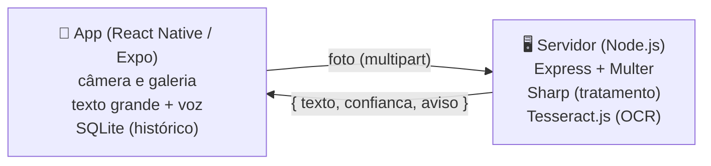

# Leitor Fácil

App de celular que transforma papel impresso em **letra grande e voz**, para idosos e pessoas com baixa visão. A pessoa fotografa uma bula, receita, conta de luz ou carta, e o app mostra o texto em fonte gigante, com alto contraste, e lê em voz alta.

MVP desenvolvido para a disciplina de Acessibilidade (**Proposta 1: Desenvolvimento de MVP Assistivo de Baixo Custo**), Engenharia de Software, UEPG.

## O problema

Muitos documentos importantes do dia a dia vêm impressos em letra pequena. Pessoas com baixa visão (catarata, glaucoma, degeneração macular, retinopatia diabética) e muitos idosos dependem de outra pessoa para lê-los, o que reduz a autonomia e pode levar a erros, como tomar um remédio na dose errada.

## Funcionalidades

- Fotografar o papel com a câmera ou escolher uma foto da galeria
- Reconhecimento de texto (OCR) em português
- Texto em letra grande, com botões para aumentar e diminuir
- Leitura em voz alta automática, com botões para parar e mudar a velocidade
- Dois temas de alto contraste: amarelo no preto e preto no branco (ambos acima do nível AAA da WCAG)
- Aviso quando a foto sai ruim (pouco nítida ou sem texto), falado e escrito
- Histórico das últimas leituras, salvo apenas no celular
- Preferências lembradas (tamanho da letra, velocidade da voz, cores)

## Decisões de acessibilidade

| Decisão | Motivo |
|---|---|
| Botões com no mínimo 88 dp de altura | Público com baixa visão e, às vezes, tremor nas mãos (a recomendação geral é 48 dp) |
| Poucos botões por tela, sempre com texto | Ícones sozinhos são difíceis de enxergar e de entender |
| `accessibilityLabel`, `accessibilityRole` e `accessibilityHint` em todos os botões | Compatível com leitores de tela (TalkBack e VoiceOver) |
| Respeita o tamanho de fonte do sistema | Quem já aumentou a fonte do celular não precisa ajustar de novo |
| Leitura automática ao abrir o resultado | A pessoa não precisa procurar o botão "ouvir" |
| Avisos falados, não só escritos | Quem não enxerga bem também fica sabendo quando algo deu errado |

## Arquitetura



- **`mobile/`**: app React Native com Expo. Usa `expo-image-picker` (câmera), `expo-speech` (voz) e `expo-sqlite` (banco local).
- **`server/`**: API Node que recebe a foto, melhora a imagem (corrige rotação, tira a cor, aumenta o contraste) e faz o OCR.

**Privacidade:** a foto é processada só na memória do servidor e descartada em seguida; nada é gravado em disco. O histórico fica apenas no SQLite do celular. Isso reduz a exposição de dados pessoais (receitas, contas), em linha com a LGPD.

**Baixo custo:** todas as bibliotecas são gratuitas e de código aberto, o OCR roda no próprio servidor (sem pagar API) e o app funciona em qualquer celular Android ou iPhone, sem hardware extra.

## Como rodar

### Pré-requisitos

- Node.js 18 ou mais recente
- Celular com o app **Expo Go** (Play Store / App Store)
- Computador e celular na mesma rede Wi-Fi

### 1. Servidor

```bash
cd server
npm install
npm start
```

O modelo de português do OCR vem junto no `npm install` (pacote `@tesseract.js-data/por`), então o servidor não baixa nada ao iniciar. Quando aparecer `Servidor no ar na porta 3000.`, está pronto.

Para testar sem o app:

```bash
curl http://localhost:3000/saude
curl -F "foto=@caminho/da/foto.jpg" http://localhost:3000/ler
```

### 2. App

1. Descubra o IP do computador na rede (Windows: `ipconfig` → "Endereço IPv4"; Linux/Mac: `ip addr`).
2. Coloque esse IP em `mobile/src/config.js`, por exemplo `http://192.168.0.15:3000`.
3. Instale e rode:

   ```bash
   cd mobile
   npm install
   npx expo install --fix
   npx expo start
   ```

4. Escaneie o QR code com o Expo Go (Android) ou com a câmera (iPhone).

> **"Project is incompatible with this version of Expo Go"?** O Expo Go da loja só roda a versão mais recente do SDK (o projeto começou no SDK 57). Atualize com `npm install expo@latest` e depois `npx expo install --fix`.

> **"Não consegui falar com o servidor"?** Confira o IP em `config.js`, se o servidor está rodando e se o firewall do Windows está liberando a porta 3000 para redes privadas.

## Estrutura do repositório

```
leitor-facil/
├── server/
│   └── src/
│       ├── index.js          # rotas da API (/ler e /saude)
│       └── ocr.js            # tratamento da imagem + Tesseract
├── mobile/
│   ├── App.js                # controle das telas e do fluxo foto → leitura
│   └── src/
│       ├── config.js         # endereço do servidor
│       ├── api.js            # envio da foto para o servidor
│       ├── db.js             # SQLite: histórico e preferências
│       ├── fala.js           # leitura em voz alta (expo-speech)
│       ├── theme.js          # cores de alto contraste e tamanhos
│       ├── components/
│       │   └── BotaoGrande.js
│       └── screens/
│           ├── InicioScreen.js
│           ├── ResultadoScreen.js
│           └── HistoricoScreen.js
└── docs/
    └── co-design.md          # registro das sessões com os usuários
```

## API

### `POST /ler`

Corpo `multipart/form-data` com o campo `foto` (imagem de até 10 MB).

Resposta:

```json
{
  "texto": "PARACETAMOL 750 mg\nTomar 1 comprimido a cada 8 horas",
  "confianca": 82,
  "aviso": null
}
```

`aviso` vem preenchido quando a confiança do OCR fica abaixo de 45% ou nenhum texto é encontrado.

Erros vêm como `{ "erro": "mensagem" }`: `400` (sem foto ou arquivo que não é imagem), `413` (maior que 10 MB) e `500` (falha no OCR).

### `GET /saude`

Retorna `{ "status": "ok" }`. Útil para saber se o servidor está no ar.

## Co-design

O processo com os participantes fica registrado em [`docs/co-design.md`](docs/co-design.md).

## Como trabalhar em grupo

1. Cada um cria uma branch a partir da `main` para o que vai fazer:
   `git checkout -b feature/nome-da-tarefa`
2. Faça commits pequenos e com mensagens claras.
3. Suba a branch (`git push -u origin feature/nome-da-tarefa`) e abra um **Pull Request** no GitHub.
4. Outra pessoa do grupo revisa antes de juntar na `main`.

### Checklist da entrega

- [ ] Sessão 1 de co-design (entrevistas) registrada
- [ ] Sessão 2 (protótipo) registrada
- [ ] App testado no celular com leitor de tela (TalkBack/VoiceOver)
- [ ] Sessão 3 (teste com o app) registrada, com a tabela "O que mudou"
- [ ] Mudanças pedidas pelos participantes implementadas
- [ ] Vídeo de até 5 min gravado (contexto → arquitetura → demonstração → próximos passos)
- [ ] Link do vídeo adicionado aqui no README

## Limitações conhecidas

- O OCR erra com fotos tremidas, escuras ou papel amassado. O app avisa quando a confiança é baixa, mas **o texto lido não substitui a orientação de um farmacêutico ou médico**.
- Precisa de internet para enviar a foto ao servidor.
- Textos manuscritos (letra de médico) geralmente não são reconhecidos.

## Autores

- Antônio Felipe Praiano
- João Victor Vardenski de Andrade
- Yuri Madureira Gouveia
